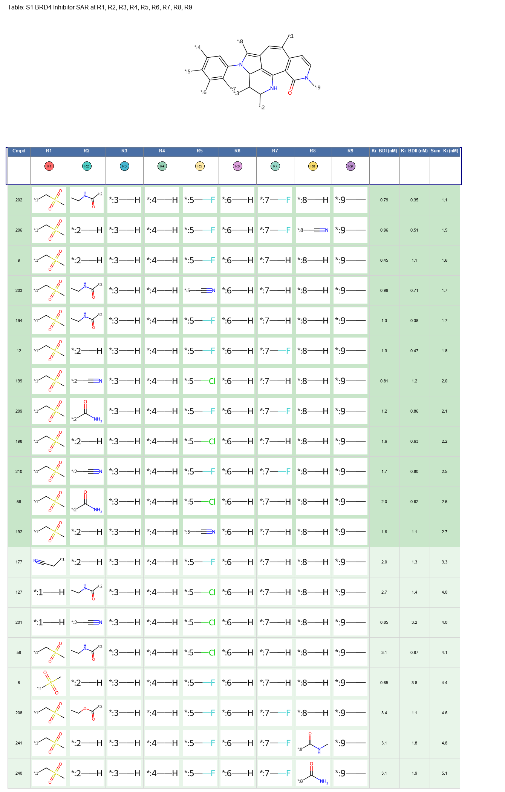

# SAR Analyzer Skill

A comprehensive agent skill for Structure-Activity Relationship (SAR) analysis of small molecule drug discovery libraries. This skill provides automated workflows for scaffold identification, R-group decomposition, molecular property calculation, and generation of publication-quality SAR tables.



## Overview

The **SAR Analyzer** skill transforms raw compound data into actionable medicinal chemistry insights through:

- **Scaffold Identification** - Automatic extraction and clustering of Murcko scaffolds
- **R-Group Decomposition** - Systematic analysis of substituent contributions to activity
- **Property Calculation** - Molecular descriptors and efficiency metrics (LE, LLE)
- **Publication-Quality Tables** - Automated generation of SAR tables with chemical structures
- **Statistical Analysis** - Correlation analysis and scaffold comparisons
- **Visualization** - Potency-lipophilicity plots and scaffold comparisons

## Key Features

✨ **Automated Workflow** - Complete SAR analysis pipeline from SMILES to publication figures  
🧬 **Cheminformatics** - Built on RDKit for robust molecular handling  
📊 **Efficiency Metrics** - Ligand Efficiency (LE) and Lipophilic Ligand Efficiency (LLE)  
🎨 **Professional Output** - Color-coded tables with summary statistics  
🔬 **Medicinal Chemistry Focus** - Designed for lead optimization campaigns  
🚀 **Scalable** - Handles compound libraries from dozens to hundreds of molecules  

## Installation

### Prerequisites

- Python 3.11+
- RDKit
- Standard scientific Python stack (pandas, matplotlib, numpy, scipy)

### Setup

```bash
# Clone the repository
git clone https://github.com/qinsizheng/sar-analyzer-skill.git
cd sar-analyzer-skill

# Install dependencies
pip install rdkit pandas matplotlib numpy scipy seaborn
```

### For Manus AI Users

**Quick Install:**

1. Open Manus AI
2. Navigate to **Skills** section
3. Click **Add** → **Import from GitHub**
4. Enter repository URL: `https://github.com/qinsizheng/sar-analyzer-skill`
5. Click **Import**

The skill will be automatically installed and ready to use!

### For Claude Code Users

**Installation:**

1. Navigate to your project's root directory in your local environment
2. Create a `.claude/skills/` directory if one does not already exist:
   ```bash
   mkdir -p .claude/skills
   ```
3. Clone the skill repository into the `.claude/skills/` directory:
   ```bash
   cd .claude/skills
   git clone https://github.com/qinsizheng/sar-analyzer-skill.git sar-analyzer
   ```
4. Ensure the skill folder contains a `SKILL.md` file at its root with YAML frontmatter
5. Commit the changes to your version control (Git) and push to GitHub:
   ```bash
   git add .claude/skills/sar-analyzer
   git commit -m "Add SAR analyzer skill"
   git push
   ```

Claude Code will automatically load skills from this directory when you are working in the project context. The skills will be immediately available to you and your team members who pull the repository.

## Quick Start

### Example Prompt (for Manus or Claude Code)

Once the skill is installed, you can use it with a simple prompt:

```
Use the sar-analyzer skill to run scaffold analysis and R-group decomposition 
analysis on the attached chemical library. Generate a figure for each major 
scaffold. Each figure should contain the scaffold structure and a table with 
R-group information and activity data. Use the figure in the examples folder 
as a reference.
```

Attach your CSV file with compound data, and the AI agent will automatically:
- Run the complete SAR analysis workflow
- Identify all major scaffolds
- Generate publication-quality SAR tables for each scaffold
- Provide statistical summaries and insights

### Input Format

Prepare a CSV file with the following columns:

- `Example_Number` or `Compound_ID` - Unique identifier
- `SMILES` - Molecular structure in SMILES notation
- `Ki_uM` - Activity data (Ki in μM)
- `Ki_2_uM` - Activity data (Ki in μM) [optional]
- `Chemical_Name` - Compound name [optional]

See [`examples/example_input.csv`](examples/example_input.csv) for a complete example.

### Basic Workflow

```bash
# Step 1: Calculate molecular properties and efficiency metrics
python3 scripts/sar_analysis.py your_data.csv

# Step 2: Identify and cluster scaffolds
python3 scripts/scaffold_analysis.py

# Step 3: Perform R-group decomposition
python3 scripts/rgroup_analysis.py

# Step 4: Generate statistical analysis
python3 scripts/sar_trends_analysis.py

# Step 5: Create visualizations
python3 scripts/create_visualizations.py

# Step 6: Generate SAR tables for all scaffolds
python3 scripts/create_s1_s7_tables.py
```

### Output

The workflow generates:

- **Data Files**
  - `data_with_analysis.csv` - Calculated properties and metrics
  - `scaffold_statistics.csv` - Scaffold-level statistics
  - `rgroup_decomposition.csv` - R-group analysis results

- **Figures**
  - `SAR_Table_S1_Complete.png` - SAR table for each major scaffold
  - `potency_vs_lipophilicity.png` - Activity-lipophilicity plot
  - `scaffold_comparison.png` - Scaffold comparison charts
  - `top_scaffolds.png` - Scaffold structure overview

## Efficiency Metrics

### Ligand Efficiency (LE)

**Formula:** `LE = pKi / Heavy Atom Count`

**Interpretation:**
- LE > 0.3: Excellent
- LE 0.25-0.3: Good
- LE < 0.25: Poor

Measures binding energy per atom; helps identify compact, efficient binders.

### Lipophilic Ligand Efficiency (LLE)

**Formula:** `LLE = pKi - cLogP`

**Interpretation:**
- LLE > 7.0: Excellent (optimal drug-like properties)
- LLE 5.0-7.0: Good
- LLE 3.0-5.0: Moderate
- LLE < 3.0: Poor (high lipophilicity liability)

Balances potency and lipophilicity; compounds with high LLE achieve good activity without excessive lipophilicity.

## Example Output

The skill generates publication-quality SAR tables like this:


**Features:**
- Core scaffold structure with labeled R-group positions
- R-group substituents for each compound
- Activity data (Ki values in nM, LLE, cLogP)
- Color-coded highlighting:
  - 🥇 Gold = Best compound
  - 🥈 Orange = 2nd best
  - 🥉 Light orange = 3rd best
  - 💚 Green = Excellent values (Ki < 5 nM or LLE > 7.0)
- Summary statistics box

## Use Cases

This skill is ideal for:

- **Lead Optimization** - Identify optimal scaffolds and substituents
- **SAR Analysis** - Understand structure-activity trends
- **Compound Prioritization** - Rank compounds by efficiency metrics
- **Patent Applications** - Generate professional SAR tables
- **Research Publications** - Create publication-ready figures
- **Project Reviews** - Summarize medicinal chemistry campaigns

## Documentation

For detailed documentation, see [`SKILL.md`](SKILL.md), which includes:

- Complete workflow descriptions
- Script usage and parameters
- Output file formats
- Best practices for SAR analysis
- Troubleshooting guide

## Contributing

Contributions are welcome! Please feel free to submit issues or pull requests.

## License

This project is licensed under the MIT License - see the [LICENSE](LICENSE) file for details.

## Citation

If you use this skill in your research, please cite:

```
SAR Analyzer Agent Skill
https://github.com/qinsizheng/sar-analyzer-skill
```

## Acknowledgments

- Built with [RDKit](https://www.rdkit.org/) - Open-source cheminformatics toolkit
- Inspired by best practices in medicinal chemistry and drug discovery

## Contact

For questions or support, please open an issue on GitHub.

---

**Keywords:** cheminformatics, drug-discovery, SAR, medicinal-chemistry, RDKit, scaffold-analysis, R-group-decomposition, ligand-efficiency, structure-activity-relationship
